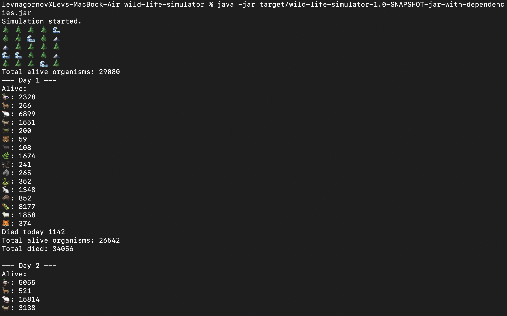

<div align="center">
    <h1>Wild life simulator</h1>
    
</div>

[](LICENSE)
[](https://github.com/RichardLitt/standard-readme)

## Description

This CLI app is an animal modeling program that allows you to see the dynamics of the ecosystem.

More description to be added...

🛠️ Simulation functionality:
- Different locations
- Movement
- Feeding
- Reproduction
  
✨ Other features:
- SOLID principles usage
- Design patterns usage: Factory, Flyweight, Dependency container, Dependency injection, Strategy
- YAML configuration
- Logs

Created by Lev Nagornov.

## Table of Contents

- [Install](#install)
- [Usage](#usage)
- [Contributing](#contributing)
- [License](#license)

## Install

1. Clone the repository using:

    ```
    git clone https://github.com/levnagornov/wild-life-simulator.git
    ```

2. Install Java if needed:
   ```
   sudo apt update
   sudo apt install default-jdk
   java -version
    ```
   
3. Download and install [Maven](https://maven.apache.org/download.cgi)

4. Build the project
   ```
   cd wild-life-simulator
   mvn package
    ```
   
5. Run the app
   ```
   java -jar target/wild-life-simulator-1.0-SNAPSHOT-jar-with-dependencies.jar
    ```

## Usage

1. Start the app.
2. Check result on the screen



You can also set parameters in configuration files to change the behavior of the simulation.

## Contributing

PRs accepted.

Small note: If editing the Readme, please conform to the [standard-readme](https://github.com/RichardLitt/standard-readme) specification.

## License

[MIT © Lev Nagornov.](./LICENSE)
